```mermaid
architecture-beta
  group edge(aws:arch-amazon-cloudfront)[Edge Layer]
  group vpc(aws:vpc)[VPC]
  group pub(aws:subnet)[Public Subnet] in vpc
  group priv(aws:subnet)[Private Subnet] in vpc

  service route53(aws:arch-amazon-route53)[Route 53] in edge
  service cloudfront(aws:arch-amazon-cloudfront)[CloudFront] in edge
  service s3(aws:arch-amazon-simple-storage-service)[S3 Static] in edge

  service apprunner(aws:arch-amazon-elastic-container-service)[App Runner] in pub
  service rds(aws:arch-amazon-rds)[RDS PostgreSQL] in priv
  service secrets(aws:arch-aws-secrets-manager)[Secrets Manager]

  route53:R --> L:cloudfront
  cloudfront:R --> L:s3
  cloudfront:B --> T:apprunner
  apprunner:B --> T:rds
  apprunner:R --> L:secrets
```

```mermaid
architecture-beta
  group edge(aws:arch-amazon-cloudfront)[Edge Layer]
  group vpc(aws:vpc)[VPC]
  group pub_az1(aws:subnet)[Public Subnet AZ1] in vpc
  group pub_az2(aws:subnet)[Public Subnet AZ2] in vpc
  group priv_az1(aws:subnet)[Private Subnet AZ1] in vpc
  group priv_az2(aws:subnet)[Private Subnet AZ2] in vpc
  group data_az1(aws:subnet)[Data Subnet AZ1] in vpc
  group data_az2(aws:subnet)[Data Subnet AZ2] in vpc

  service route53(aws:arch-amazon-route53)[Route 53] in edge
  service waf(aws:arch-aws-waf)[WAF Shield] in edge
  service cloudfront(aws:arch-amazon-cloudfront)[CloudFront] in edge

  service alb(aws:arch-elastic-load-balancing)[ALB AZ1] in pub_az1
  service alb2(aws:arch-elastic-load-balancing)[ALB AZ2] in pub_az2
  service cognito(aws:arch-amazon-cognito)[Cognito] in pub_az1
  service apigw(aws:arch-amazon-api-gateway)[API Gateway] in pub_az1

  service ecs(aws:arch-amazon-elastic-container-service)[ECS Fargate AZ1] in priv_az1
  service ecs2(aws:arch-amazon-elastic-container-service)[ECS Fargate AZ2] in priv_az2
  service sqs(aws:arch-amazon-simple-queue-service)[SQS Queue] in priv_az1
  service lambda(aws:arch-aws-lambda)[Lambda Workers] in priv_az2

  service aurora(aws:arch-amazon-aurora)[Aurora Primary] in data_az1
  service aurora2(aws:arch-amazon-aurora)[Aurora Replica] in data_az2
  service elasticache(aws:arch-amazon-elasticache)[ElastiCache Redis] in data_az1

  service cloudwatch(aws:arch-amazon-cloudwatch)[CloudWatch]
  service xray(aws:arch-aws-x-ray)[XRay Tracing]
  service secrets(aws:arch-aws-secrets-manager)[Secrets Manager]

  route53:R --> L:waf
  waf:R --> L:cloudfront
  cloudfront:B --> T:alb
  alb:R --> L:cognito
  alb:B --> T:apigw
  apigw:R --> L:ecs
  ecs:R --> L:elasticache
  ecs:B --> T:aurora
  ecs:R --> L:sqs
  sqs:R --> L:lambda
  aurora:R --> L:aurora2
  ecs2:B --> T:aurora2
  lambda:R --> L:secrets
```

```mermaid
architecture-beta
  group edge(aws:arch-amazon-cloudfront)[Edge Layer]
  group vpc(aws:vpc)[VPC]
  group pub_az1(aws:subnet)[Public Subnet AZ1] in vpc
  group pub_az2(aws:subnet)[Public Subnet AZ2] in vpc
  group priv_az1(aws:subnet)[Private Subnet AZ1] in vpc
  group priv_az2(aws:subnet)[Private Subnet AZ2] in vpc
  group data_az1(aws:subnet)[Data Subnet AZ1] in vpc
  group data_az2(aws:subnet)[Data Subnet AZ2] in vpc

  service route53(aws:arch-amazon-route53)[Route 53] in edge
  service waf(aws:arch-aws-waf)[WAF Shield Advanced] in edge
  service cloudfront(aws:arch-amazon-cloudfront)[CloudFront] in edge

  service apigw(aws:arch-amazon-api-gateway)[API Gateway] in pub_az1
  service alb(aws:arch-elastic-load-balancing)[ALB AZ1] in pub_az1
  service alb2(aws:arch-elastic-load-balancing)[ALB AZ2] in pub_az2

  service eks(aws:arch-amazon-elastic-kubernetes-service)[EKS AZ1] in priv_az1
  service eks2(aws:arch-amazon-elastic-kubernetes-service)[EKS AZ2] in priv_az2
  service msk(aws:arch-amazon-kinesis)[MSK Kafka] in priv_az1
  service lambda(aws:arch-aws-lambda)[Lambda Consumer] in priv_az2

  service aurora(aws:arch-amazon-aurora)[Aurora Primary] in data_az1
  service aurora2(aws:arch-amazon-aurora)[Aurora Replica] in data_az2
  service dynamo(aws:arch-amazon-dynamodb)[DynamoDB] in data_az1
  service elasticache(aws:arch-amazon-elasticache)[ElastiCache Redis] in data_az1

  service cloudwatch(aws:arch-amazon-cloudwatch)[CloudWatch]
  service xray(aws:arch-aws-x-ray)[XRay Tracing]
  service guardduty(aws:arch-aws-identity-and-access-management)[GuardDuty IAM]

  route53:R --> L:waf
  waf:R --> L:cloudfront
  cloudfront:B --> T:alb
  alb:B --> T:apigw
  apigw:R --> L:eks
  eks:B --> T:aurora
  eks:R --> L:dynamo
  eks:R --> L:elasticache
  eks:R --> L:msk
  msk:R --> L:lambda
  aurora:R --> L:aurora2
  eks2:B --> T:aurora2
  eks:T --> B:cloudwatch
  eks:T --> B:xray
```

# AWS Architecture Examples

> Real-world AWS architecture decisions by project type.

---

## Example 1: MVP Web App (Startup / Solo Developer)

```yaml
Requirements:
  - <1000 users initially
  - Limited operational bandwidth
  - Fast to market (4-8 weeks)
  - Strict budget constraints

Architecture Decisions:
  Compute: AWS App Runner or Elastic Beanstalk (Simpler to deploy)
  Database: RDS PostgreSQL (Single-AZ) or DynamoDB (On-demand)
  Storage: Amazon S3 (static assets)
  CDN: CloudFront
  DNS: Route53

Trade-offs Accepted:
  - Single-AZ Database: Potential downtime during maintenance (acceptable for MVP)
  - App Runner: Less granular control over orchestration (speed of deployment wins)

Future Migration Path:
  - Users > 10K: Enable Multi-AZ for RDS
  - Custom container needs: Migrate Compute to ECS Fargate
```



---

## Example 2: B2B SaaS Product — 100K Users (Mid-size Team)

```yaml
Requirements:
  - 1K-100K users, sustained traffic
  - High Availability (99.9% Uptime SLA)
  - Multi-tenant data segregation
  - CI/CD automation needed

Architecture Decisions:
  Compute: ECS Fargate (Serverless Containers, Multi-AZ)
  Database: Aurora PostgreSQL (Multi-AZ + Read Replica)
  Caching: ElastiCache for Redis
  Auth: Cognito User Pool
  Message Broker: SQS / SNS (Loose coupling for async tasks)
  Network: VPC with Public + Private Subnets, ALB, NAT Gateway
  IaC: Terraform or CDK

Trade-offs Accepted:
  - Fargate vs EKS: Easier overhead but slightly less Kubernetes customization
  - NAT Gateway Cost: High data processing cost, but necessary for private subnet security
  - Aurora Cost: Higher base price than RDS, but extreme HA and fast failover (<30s)

Migration Path:
  - Need extreme scale / orchestration: Migrate ECS to Amazon EKS
  - Global users: Consider Aurora Global Database
```



---

## Example 3: Enterprise Microservices — Millions of Users (High Scale)

```yaml
Requirements:
  - Millions of users
  - 24/7 availability (99.99%)
  - Intense data volume and strict compliance
  - Decoupled teams

Architecture Decisions:
  Compute: Amazon EKS (Kubernetes)
  API Gateway: Amazon API Gateway or Kong ingress
  Databases: Polyglot — DynamoDB (high-speed K/V), Aurora (Relational)
  Event Streaming: Amazon MSK (Managed Kafka)
  Security: AWS WAF, Shield Advanced, GuardDuty
  Observability: XRay, CloudWatch, Prometheus/Grafana

Operational Requirements:
  - GitOps using ArgoCD
  - Multi-Region Active-Active or Active-Passive Setup
  - Full IaC automation with strict IAM SCP boundaries
  - FinOps Dashboards with strict cost tagging
```


