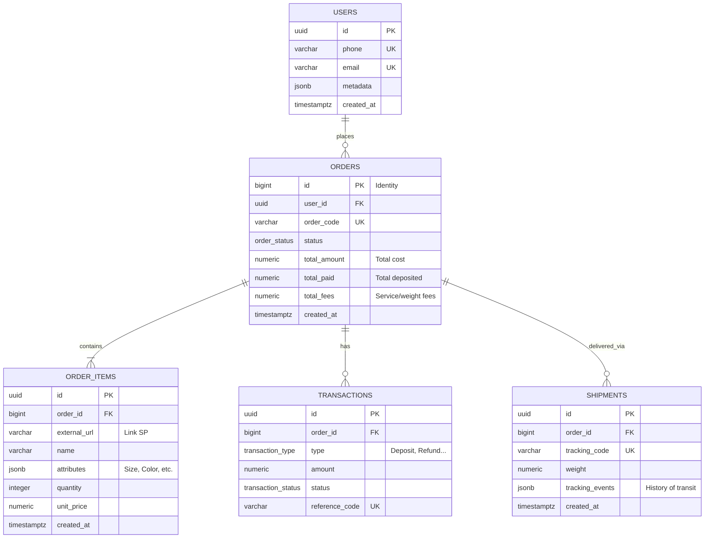

# Thiết Kế Database: Hệ Thống Mua Hàng Order

Dựa trên nguyên tắc của **PostgreSQL Database Architect**, tôi đã phân tích và thiết kế mô hình cơ sở dữ liệu chuyên biệt cho nghiệp vụ "Mua hàng Order" (Pre-order / Hộ mua hộ). 

Nghiệp vụ mua hàng Order có các đặc thù:
- **Trạng thái phức tạp**: Đặt hàng (Deposit), Mua hộ (Purchased), Tới kho (At Warehouse), Vận chuyển (Shipping), Đã giao (Delivered).
- **Chi phí động**: Giá sản phẩm + Tỉ giá + Phí cân nặng + Phí dịch vụ.
- **Dữ liệu linh hoạt**: Link sản phẩm, thuộc tính (Màu sắc, Size) thường không nhất quán do link từ nhiều nguồn (Taobao, Amazon, v.v.).

---

## 1. Biểu Đồ Thực Thể - Liên Kết (ERD)



---

## 2. Các Quyết Định Kiến Trúc (Architecture Decisions)

### 2.1. Lựa chọn Data Type Chuẩn PostgreSQL
- **Primary Key (PK)**: 
  - Bảng `orders` dùng `BIGINT GENERATED ALWAYS AS IDENTITY`. Lý do: Bảng Orders tham gia JOIN liên tục, BIGINT giúp B-tree index tối ưu hơn kích cỡ block và fetch nhanh hơn UUID.
  - Các bảng `users`, `order_items`, `transactions`, `shipments` dùng `UUID` (ẩn logic, khó cào dữ liệu qua số thứ tự).
- **Tiền tệ (Currency)**: Sử dụng `NUMERIC(15,2)` thay vì `FLOAT` tránh lỗi tính toán.
- **Ngày tháng**: Dùng timezone-aware `TIMESTAMPTZ`.
- **Trạng Thái (Status)**: Sử dụng `ENUM` của Postgres (`order_status`, `transaction_status`). Bảo vệ dữ liệu ở tầng DB không cho nhập status ngớ ngẩn.

### 2.2. Tận dụng `JSONB` cho Dữ liệu Động
- **`ORDER_ITEMS.attributes`**: Khi mua hộ từ các nguồn khác nhau, thuộc tính sản phẩm không cố định (có lúc là {"size": "L"}, có lúc là {"color": "red", "length": "long"}). `JSONB` kết hợp với index `GIN` sẽ loại bỏ việc phải tạo 1 bảng Entity-Attribute-Value rườm rà.
- **`SHIPMENTS.tracking_events`**: Hành trình vận chuyển (VD: Tới kho TQ -> Vận chuyển về HN) có số lượng không cố định, lưu dưới dạng mảng JSONB array để đỡ bị rác bảng `tracking_logs`.

### 2.3. Tối ưu Concurrency ở bảng TRANSACTIONS
- Khi nhận được deposit (tiền cọc), phải cập nhật `total_paid` cho `ORDERS`. Bắt buộc phải Lock dòng order thay vì chạy ngầm dẫn tới Race Condition: `SELECT * FROM orders WHERE id=? FOR UPDATE;`

---

## 3. Mã SQL Thực Tế (DDL)

```sql
-- 1. Create Enums
CREATE TYPE order_status AS ENUM (
    'PENDING_DEPOSIT', 
    'PURCHASING', 
    'AT_OVERSEAS_WAREHOUSE', 
    'SHIPPING', 
    'DELIVERED',
    'CANCELLED'
);

CREATE TYPE transaction_type AS ENUM ('DEPOSIT', 'PAYMENT', 'REFUND', 'FEE_CHARGE');
CREATE TYPE transaction_status AS ENUM ('PENDING', 'SUCCESS', 'FAILED');

-- 2. DDL Bảng
CREATE TABLE users (
    id UUID PRIMARY KEY DEFAULT gen_random_uuid(),
    phone VARCHAR(20) UNIQUE,
    email VARCHAR(255) UNIQUE,
    metadata JSONB DEFAULT '{}'::jsonb,
    created_at TIMESTAMPTZ NOT NULL DEFAULT NOW()
);

CREATE TABLE orders (
    id BIGINT GENERATED ALWAYS AS IDENTITY PRIMARY KEY,
    user_id UUID NOT NULL REFERENCES users(id) ON DELETE RESTRICT,
    order_code VARCHAR(30) UNIQUE NOT NULL,
    status order_status NOT NULL DEFAULT 'PENDING_DEPOSIT',
    total_amount NUMERIC(15,2) NOT NULL DEFAULT 0.00,
    total_paid NUMERIC(15,2) NOT NULL DEFAULT 0.00,
    total_fees NUMERIC(15,2) NOT NULL DEFAULT 0.00,
    created_at TIMESTAMPTZ NOT NULL DEFAULT NOW(),
    updated_at TIMESTAMPTZ NOT NULL DEFAULT NOW()
);

-- Index user cho query lấy danh sách dể quản trị
CREATE INDEX idx_orders_user_id ON orders(user_id);
-- Partial Index cực ký quan trọng: Chỉ đánh index các đơn chưa hoàn tất (vì số lượng này nhỏ, tìm cực nhanh).
CREATE INDEX idx_orders_active ON orders(status) WHERE status != 'DELIVERED'; 

CREATE TABLE order_items (
    id UUID PRIMARY KEY DEFAULT gen_random_uuid(),
    order_id BIGINT NOT NULL REFERENCES orders(id) ON DELETE CASCADE,
    external_url TEXT NOT NULL,
    name VARCHAR(500) NOT NULL,
    attributes JSONB DEFAULT '{}'::jsonb,
    quantity INTEGER NOT NULL CHECK (quantity > 0),
    unit_price NUMERIC(15,2) NOT NULL DEFAULT 0.00,
    created_at TIMESTAMPTZ NOT NULL DEFAULT NOW()
);

CREATE INDEX idx_order_items_order_id ON order_items(order_id);
-- Index GIN để có thể tìm: Lấy tất cả Món Đồ là màu HỒNG {"color": "pink"}
CREATE INDEX idx_order_items_attributes ON order_items USING GIN (attributes);

CREATE TABLE transactions (
    id UUID PRIMARY KEY DEFAULT gen_random_uuid(),
    order_id BIGINT NOT NULL REFERENCES orders(id) ON DELETE RESTRICT,
    type transaction_type NOT NULL,
    amount NUMERIC(15,2) NOT NULL,
    status transaction_status NOT NULL DEFAULT 'PENDING',
    reference_code VARCHAR(100) UNIQUE,
    created_at TIMESTAMPTZ NOT NULL DEFAULT NOW()
);

CREATE INDEX idx_transactions_order_id ON transactions(order_id);

CREATE TABLE shipments (
    id UUID PRIMARY KEY DEFAULT gen_random_uuid(),
    order_id BIGINT NOT NULL REFERENCES orders(id) ON DELETE CASCADE,
    tracking_code VARCHAR(100) UNIQUE NOT NULL,
    weight NUMERIC(10,2),
    tracking_events JSONB DEFAULT '[]'::jsonb,
    created_at TIMESTAMPTZ NOT NULL DEFAULT NOW()
);

CREATE INDEX idx_shipments_order_id ON shipments(order_id);
```
